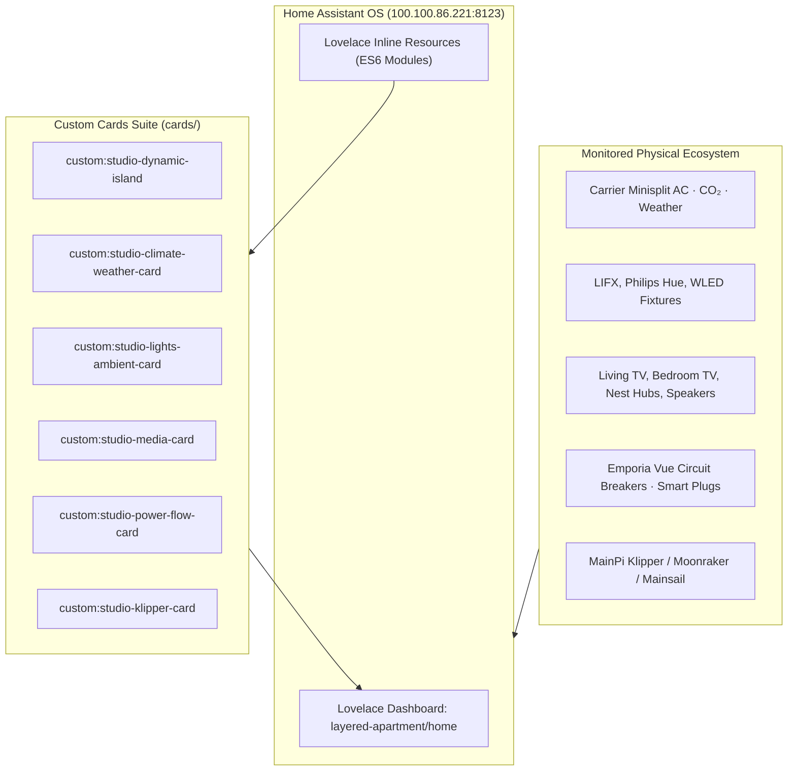

# Engineering Handoff: HAOS Studio Dashboard & Custom Cards Suite

**Recipient:** Jules  
**Author:** Pair-Programming AI Assistant & Derek (@treatbam)  
**Date:** September 29, 2026  
**Repository:** [https://github.com/treatbam/layered-apartment](https://github.com/treatbam/layered-apartment)  
**Live Dashboard:** `http://100.100.86.221:8123/layered-apartment/home`  
**Workspace Directory:** `/home/pi/haos`  

---

## 1. Executive Summary

This handoff documents the end-to-end design, implementation, and deployment of a bespoke, glassmorphic Home Assistant dashboard ecosystem tailored for a high-density, automated studio apartment.

All front-end components were authored as vanilla ES6 Web Components (custom Lovelace cards) adhering to an obsidian glassmorphism design system (`DESIGN.md`). The cards are registered directly inside Home Assistant OS via inline Lovelace resources, fully audited for security and privacy, and version-controlled on GitHub.



---

## 2. Architecture & Design System

The visual language is defined in [`DESIGN.md`](file:///home/pi/haos/DESIGN.md) in the repository:

* **Materials & Glassmorphism**:
  * Outer card border radius: `32px`
  * Nested controls / buttons: `16px` – `20px`
  * Background fill: `rgba(16, 20, 32, 0.72)` with `backdrop-filter: blur(24px) saturate(140%)`
  * Border stroke: `1px solid rgba(255, 255, 255, 0.10)` with micro-rim highlights (`rgba(255, 255, 255, 0.18)` top specular bevel)
  * Dynamic box shadows with state-coded colored ambient glows.
* **Layout Structure**:
  * Home Assistant `sections` view layout with `max_columns: 2` and `dense_section_placement: true`.
  * Grid-based responsiveness with 12-column sub-divisions.
* **Popups & Navigation**:
  * Deep-dive controls are offloaded into Bubble Card `#hash` popups (`#lights`, `#climate`, `#media`, `#power`, `#network`, `#weather`), keeping the main dashboard decluttered.
  * Bottom floating navigation bar uses Bubble Card footer dock mode (`footer_mode: true`).

---

## 3. Custom Lovelace Cards Inventory

All card source files live in [`cards/`](file:///home/pi/haos/cards) (with pre-built `.min.js` equivalents) and are registered as inline modules in Home Assistant:

| Card Type Tag | Resource ID | Primary Purpose | State Reactivity / Highlights |
|---|---|---|---|
| `custom:studio-dynamic-island` | `779af22d81a248d499b3bbfcd8a123d1` | Header status HUD & live activity takeover | Resting pill $\rightarrow$ Now Playing vinyl/waveform $\rightarrow$ Party Hue chromatic aura $\rightarrow$ Overpower pulse (>1.1kW) $\rightarrow$ Spring expansion cockpit. |
| `custom:studio-climate-weather-card` | `ef6e835478184c36bfbbed6d08d910ce` | Mirrored HVAC & celestial weather engine | Procedural sky (sun rays, rain streaks, starfield, lightning), architectural floorplan overlay, animated minisplit airflow vortices (Cyan/Orange/White), mirrored exact 3-column layout. |
| `custom:studio-lights-ambient-card` | `cbfc162c8f0a4092ae820130300de91f` | Studio lighting master & zone control | Master studio dimmer slider, 4 architectural zone tiles (Living, Desk, Bed, Bath) with 1-tap room toggles, live RGB bulb halos, 8 quick color/kelvin presets. |
| `custom:studio-media-card` | `274d0c79341e4ab9978cb2b1bec205ca` | Smart video & music streaming decks | Auto-discovers and attaches to whichever screen or speaker is currently streaming; **twin-bubble dynamic splitting** if $\ge 2$ screens play concurrently; album art chromatic mesh glow; acoustic equalizer. |
| `custom:studio-power-flow-card` | `3b34f3df50894139b5d3c2033d0542e2` | Liquid glass Sankey power flow | Proportional bezier vector ribbons with animated wattage particles, sub-meter breaker hierarchy (Network Server $\rightarrow$ Balance, 3D Printer $\rightarrow$ Bedroom Outlets), interactive stream isolation. |
| `custom:studio-klipper-card` | `a67a32720d704039b0b543a83bffa03c` | Bambu Lab lookalike 3D printer card | Dual radial thermal gauges (nozzle & bed), shine-sweeper progress bar, G-code thumbnail / live webcam toggle, telemetry matrix, double-click cancel protection, Mainsail launcher. |

---

## 4. Key Configurations & Breaker Hierarchy

### Energy Sub-Metering & Circuit Hierarchy
A critical requirement was avoiding perceived double-counting of sub-devices that physically sit behind monitored circuit breakers:
1. **Balance Panel Breaker** (`sensor.balance_power_minute_average`):
   - Feeds: **Network Server** (`sensor.networknonups_energy_power`).
   - Card configuration: tagged with `parent: 'bal'` and `subtag: '↳ Balance Breaker'`.
2. **Bedroom Outlets Breaker** (`sensor.bedroom_receptacles_power_minute_average`):
   - Feeds: **3D Printer / MainPi** (`sensor.klipper_energy_power`).
   - Card configuration: tagged with `parent: 'bed'` and `subtag: '↳ Bedroom Breaker'`.

### Klipper 3D Printer Entity Mapping
The card interfaces with the Moonraker / Mainsail integration on Home Assistant:
- **Print State**: `sensor.mainpi_current_print_state` (`standby`, `printing`, `paused`, `complete`, `cancelled`, `error`)
- **Job Progress**: `sensor.mainpi_progress` (0–100%)
- **Temperatures**:
  - Extruder: `sensor.mainpi_extruder_temperature` (target: attribute or fallback)
  - Heatbed: `sensor.mainpi_bed_temperature` (target: attribute or fallback)
- **Cameras**: `camera.mainpi_thumbnail` (G-code preview) & `camera.mainpi_usb` (live video)
- **Actions**: `button.mainpi_pause_print`, `button.mainpi_resume_print`, `button.mainpi_cancel_print`, `button.mainpi_home_all_axes`, `button.mainpi_emergency_stop`
- **Lighting**: `light.moonraker_lightswitch`
- **Mainsail Web UI URL**: `http://192.168.86.220`

---

## 5. Repository Structure (`treatbam/layered-apartment`)

The repository on GitHub is public and fully initialized:

```text
treatbam/layered-apartment/
├── .gitignore
├── DESIGN.md                         # Complete design system & token definitions
├── HANDOFF.md                        # This handoff briefing document
├── README.md                         # Project overview, feature guide & install notes
├── cards/                            # Production JavaScript custom cards
│   ├── studio-climate-weather-card.js
│   ├── studio-climate-weather-card.min.js
│   ├── studio-dynamic-island.js
│   ├── studio-dynamic-island.min.js
│   ├── studio-klipper-card.js
│   ├── studio-klipper-card.min.js
│   ├── studio-lights-ambient-card.js
│   ├── studio-lights-ambient-card.min.js
│   ├── studio-media-card.js
│   ├── studio-media-card.min.js
│   ├── studio-power-flow-card.js
│   └── studio-power-flow-card.min.js
└── dashboards/
    └── layered-apartment.yaml        # Full raw YAML dump of the Lovelace dashboard
```

---

## 6. How to Deploy & Maintain Changes

### Updating Card Source Code
1. The working directory is `/home/pi/haos/cards/`.
2. Cards are standard ES6 custom elements extending `HTMLElement`. When modifying a card:
   - Edit the `.js` file.
   - Update the `.min.js` file (or keep them synchronized).
3. **Updating Home Assistant Resources**:
   - Because HA uses inline module resources, update the resource using `ha_config_set_dashboard_resource`:
     ```python
     ha_config_set_dashboard_resource(
         content="<new js content>",
         resource_id="<resource_id_from_table_above>",
         resource_type="module"
     )
     ```
   - Alternatively, if migrating to `/local/` static files:
     - Copy the files to `/config/www/studio/`.
     - Point resources to `/local/studio/<card-name>.js?v=<timestamp>`.
4. **Pushing Updates to GitHub**:
   - Git remote is pre-authenticated via Windows Git Credential Manager on the machine:
     ```bash
     cd /home/pi/haos
     git add -A
     git commit -m "Describe your update"
     git push origin main
     ```

### Modifying Dashboard Layout (`layered-apartment`)
- Always use `ha_config_get_dashboard(url_path="layered-apartment")` to obtain the fresh `config_hash`.
- Apply updates using `ha_config_set_dashboard` via python transform or payload replacement.
- To re-export the current dashboard YAML to the repository:
  ```bash
  python3 -c "
  import json, yaml, os
  # Dump latest config from ha_config_get_dashboard into dashboards/layered-apartment.yaml
  "
  ```

---

## 7. Recommended Next Iterations for Jules

1. **HACS / GitHub Action Packaging**:
   - Consider adding a GitHub workflow to auto-minify and release tags so cards can be installed individually via HACS custom repository mode.
2. **Klipper Card Heat-Up Animation**:
   - Add a subtle pulsing glow on the radial dials when target temperature is set but actual temperature is still climbing ($T_{current} < T_{target} - 2^\circ\text{C}$).
3. **Weather Card Radar Integration**:
   - An experimental rain radar tile is currently in popups (`#weather`); a mini Doppler loop could be added as an optional foldout layer in the sky engine.
4. **Dynamic Island Additional Triggers**:
   - Consider adding a notification badge trigger if the 3D printer finishes a print or triggers an error state.

---

*Handoff complete! All cards are operating live on Home Assistant OS and tracking `origin/main` on GitHub.*
